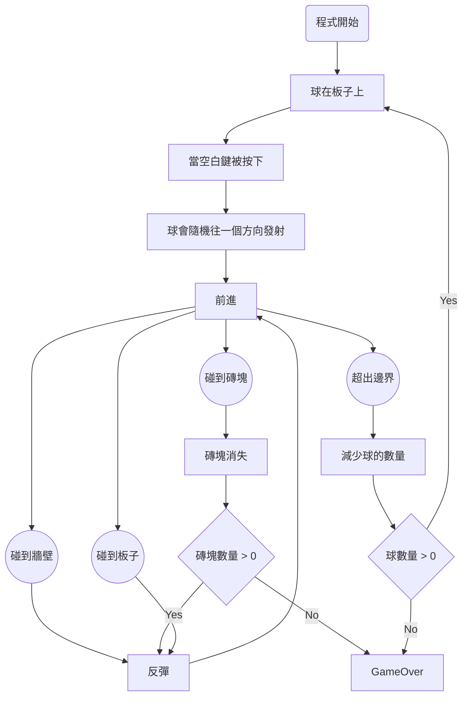

```mermaid
graph TD;
start("程式開始") -->
球在板子上 --> 當空白鍵被按下 --> 球會隨機往一個方向發射 --> go["前進"] -->
wall(("碰到牆壁")) & br(("碰到磚塊")) & board(("碰到板子")) & out(("超出邊界"))

wall --> 反彈 --> go
br --> 磚塊消失 --> br_remain{"磚塊數量 > 0"}
br_remain --> |Yes| 反彈
br_remain --> |No| GameOver
board --> 反彈
out --> 減少球的數量 --> remain{"球數量 > 0"}
remain --> |Yes| 球在板子上
remain --> |No| GameOver

GameOver
```
